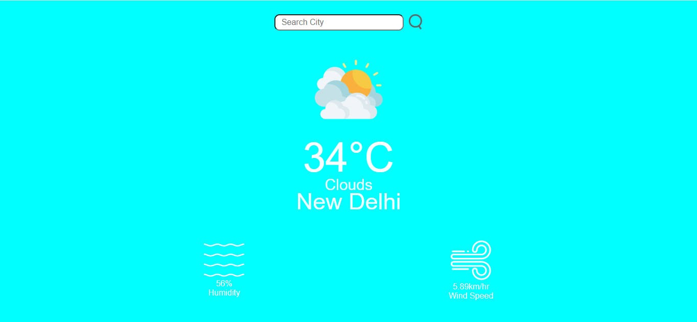

# 🌦️ Weather App

A simple and responsive weather application built with **HTML**, **CSS**, and **JavaScript**. It allows users to search for any city and get real-time weather data using the **OpenWeatherMap API**.

---

## 🔍 Features

- 🌐 Search weather by city name
- 🌡️ Display temperature, weather condition, and icon
- 🎨 Minimal and responsive UI
- 🔁 Fetches real-time data from OpenWeatherMap API

---

 


## 🛠️ Tech Stack

- **HTML**  
- **CSS**  
- **JavaScript**  
- **OpenWeatherMap API**

---

## 📦 Getting Started

Clone the repository:

```bash
git clone https://github.com/ArjavJ-code/weather-app.git
cd weather-app
